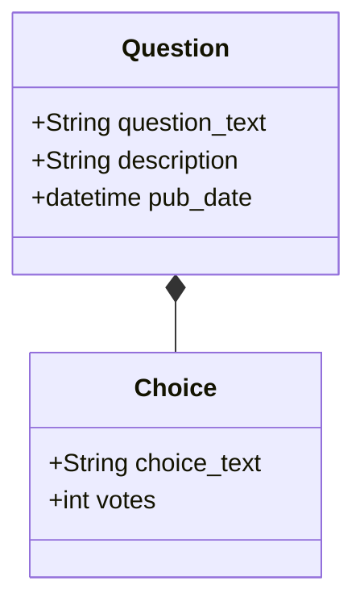

## optimizing postgresql performance in django

Ahmad Fanaei

---

#### A bit about me
 
- Python & Django developer
- backend & data team @ torob.com


---

#### what can degrade django performance?

- n+1 select
- Select unnecessary stuff
- Blocking migrations
- Pagination
- Slow queries

---

#### what tools can be used to find and fix these issues

- django_debug_toolbar
- assertNumQueries
- squawk
- pg_stat_statment

---

#### Django ORM is amazing but ...

---

#### All non-trivial abstractions, to some degree, are leaky. [1](https://www.joelonsoftware.com/2002/11/11/the-law-of-leaky-abstractions/)

- unexpected query
- not optimal queries
- blocking migrations

---

<!-- .slide: data-transition="slide" data-background="#b5533c" data-background-transition="zoom" -->
# Tools

---

### django_debug_toolbar [2](https://github.com/jazzband/django-debug-toolbar)

 

---

### assert Num Queries

```python
def test_past_question(self):
    """
    The detail view of a question with a pub_date in the past
    displays the question's text.
    """
    past_question = create_question(question_text='Past Question.', days=-5)
    url = reverse('polls:detail', args=(past_question.id,))

    with self.assertNumQueries(1):
        response = self.client.get(url)
    self.assertContains(response, past_question.question_text)
```

--

### assert Num Queries

```bash
root@6d9a68a2769f:/app# python manage.py test polls.tests.QuestionDetailViewTests.test_past_question
Found 1 test(s).
Creating test database for alias 'default'...
System check identified no issues (0 silenced).
F
======================================================================
FAIL: test_past_question (polls.tests.QuestionDetailViewTests)
The detail view of a question with a pub_date in the past
----------------------------------------------------------------------
Traceback (most recent call last):
  File "/app/polls/tests.py", line 128, in test_past_question
    response = self.client.get(url)
  File "/usr/local/lib/python3.9/site-packages/django/test/testcases.py", line 86, in __exit__
    self.test_case.assertEqual(
AssertionError: 2 != 1 : 2 queries executed, 1 expected
Captured queries were:
1. SELECT "polls_question"."id", "polls_question"."question_text", "polls_question"."pub_date" FROM "polls_question" WHERE ("polls_question"."pub_date" <= '2022-02-13T22:14:30.093869+00:00'::timestamptz AND "polls_question"."id" = 1) LIMIT 21
2. SELECT "polls_choice"."id", "polls_choice"."question_id", "polls_choice"."choice_text", "polls_choice"."votes" FROM "polls_choice" WHERE "polls_choice"."question_id" = 1

----------------------------------------------------------------------
Ran 1 test in 0.034s

FAILED (failures=1)
Destroying test database for alias 'default'...
```

---

### squawk [3](https://github.com/sbdchd/squawk)

```bash
❯ squawk example.sql
example.sql:2:1: warning: prefer-text-field

   2 | --
   3 | -- Create model Bar
   4 | --
   5 | CREATE TABLE "core_bar" (
   6 |     "id" serial NOT NULL PRIMARY KEY,
   7 |     "alpha" varchar(100) NOT NULL
   8 | );

  note: Changing the size of a varchar field requires an ACCESS EXCLUSIVE lock.
  help: Use a text field with a check constraint.
```

---

### pg_stat_statment

```sql
postgres=# CREATE EXTENSION pg_stat_statements;
ERROR:  extension "pg_stat_statements" already exists
postgres=# \d pg_stat_statements
                    View "public.pg_stat_statements"
       Column        |       Type       | Collation | Nullable | Default 
---------------------+------------------+-----------+----------+---------
 query               | text             |           |          | 
 calls               | bigint           |           |          | 
 total_time          | double precision |           |          | 
 min_time            | double precision |           |          |
 max_time            | double precision |           |          |
 mean_time           | double precision |           |          |
 stddev_time         | double precision |           |          |
```

---

<!-- .slide: data-transition="slide" data-background="#b5533c" data-background-transition="zoom" -->
# Example

---

### Data model


---

### API

```python
urlpatterns = [
    path('', views.IndexView.as_view(), name='index'),
    path('<int:pk>/', views.DetailView.as_view(), name='detail'),
    path('<int:pk>/results/', views.ResultsView.as_view(), name='results'),
    path('<int:question_id>/vote/', views.vote, name='vote'),
]
```

---

<!-- .slide: data-transition="slide" data-background="#b5533c" data-background-transition="zoom" -->
# n+1 query problem

---

 

---

```python
class IndexView(generic.ListView):
    template_name = 'polls/index.html'
    context_object_name = 'latest_question_list'

    def get_queryset(self):
        """
        Return the last five published questions
        """
        return (
            Question.objects
            .filter(pub_date__lte=timezone.now())
            .order_by('-pub_date')[:5]
        )
```

--

```html
<div style="padding: 16px;">

    <a href="">{{ question.question_text }}</a>
    <ul style="margin-top: 0">
        
            <li>{{ choice.choice_text }} -- {{ choice.votes }} vote{{ choice.votes|pluralize }}</li>
        
    </ul>

</div>
```

---

 

---

select_related: Returns a QuerySet that will “follow” foreign-key relationships

prefetch_related: Returns a QuerySet that will automatically retrieve, in a single batch, related objects

--

```python
class IndexView(generic.ListView):
    template_name = 'polls/index.html'
    context_object_name = 'latest_question_list'

    def get_queryset(self):
        """
        Return the last five published questions
        """
        return (
            Question.objects
            .prefetch_related('choice_set')
            .filter(pub_date__lte=timezone.now())
            .order_by('-pub_date')[:5]
        )
```


---

 

---

### assert Num Queries

```python
def test_past_question(self):
    """
    Questions with a pub_date in the past are displayed on the
    index page.
    """
    create_question(question_text="Past question.", days=-30)
    create_question(question_text="Past question. 2", days=-15)
    with self.assertNumQueries(2):
        self.client.get(reverse('polls:index'))
```

---

<!-- .slide: data-transition="slide" data-background="#b5533c" data-background-transition="zoom" -->
# excess Selection

---

By default django selects all columns.


```python
list(
    Question.objects
    .prefetch_related('choice_set')
    .filter(pub_date__lte=timezone.now())
    .order_by('-pub_date')[:5]
)

```

--

```sql
SELECT
  "polls_question"."id",
  "polls_question"."question_text",
  "polls_question"."description",
  "polls_question"."pub_date"
FROM "polls_question"
WHERE
  "polls_question"."pub_date" <= \'2022-02-14T21:19:25.545889+00:00\'::timestamptz
ORDER BY "polls_question"."pub_date"
DESC LIMIT 5
```

---

Limit selected columns using `values` or `only`

```python
list(
    Question.objects
    .prefetch_related('choice_set')
    .only('question_text')
    .filter(pub_date__lte=timezone.now())
    .order_by('-pub_date')[:5]
)

```

--

```sql
SELECT
  "polls_question"."id",
  "polls_question"."question_text"
  FROM "polls_question"
  WHERE "polls_question"."pub_date" <= \'2022-02-14T21:21:36.022491+00:00\'::timestamptz
  ORDER BY "polls_question"."pub_date"
  DESC LIMIT 5
```

---

### A few month later

 

---

## always prefer `values` over `only`

---

<!-- .slide: data-transition="slide" data-background="#b5533c" data-background-transition="zoom" -->
# Blocking migrations

---

#### make questions unique

```python
question_text = models.CharField(max_length=200, unique=True)
```

--

```sql
BEGIN;
--
-- Alter field question_text on question
--
ALTER TABLE "polls_question" ADD CONSTRAINT "polls_question_question_text_e0c682c7_uniq" UNIQUE ("question_text");
CREATE INDEX "polls_question_question_text_e0c682c7_like" ON "polls_question" ("question_text" varchar_pattern_ops);
COMMIT;
```

---

> ... a standard index build locks out writes (but not reads) on the table until it's done

---

#### squawk

```bash
root@6d9a68a2769f:/app# ./squawk-linux-x86_64 out.sql
out.sql:2:1: warning: disallowed-unique-constraint

   2 | --
   3 | -- Alter field question_text on question
   4 | --
   5 | ALTER TABLE "polls_question" ADD CONSTRAINT "polls_question_question_text_e0c682c7_uniq" UNIQUE ("question_text");

  note: Adding a UNIQUE constraint requires an ACCESS EXCLUSIVE lock which blocks reads.
  help: Create an index CONCURRENTLY and create the constraint using the index.
```
--

```bash
out.sql:6:1: warning: require-concurrent-index-creation

   6 | CREATE INDEX "polls_question_question_text_e0c682c7_like" ON "polls_question" ("question_text" varchar_pattern_ops);    

  note: Creating an index blocks writes.
  help: Create the index CONCURRENTLY.

find detailed examples and solutions for each rule at https://squawkhq.com/docs/rules
```

---

<!-- .slide: data-transition="slide" data-background="#b5533c" data-background-transition="zoom" -->
# Pagination

---

### what is the problem

 

---

### default pagination 

```python
class IndexView(generic.ListView):
    template_name = 'polls/index.html'
    context_object_name = 'latest_question_list'
    paginate_by = 5

    def get_queryset(self):
        """
        Return the last five published questions (not including those set to be
        published in the future).
        """
        return Question.objects.prefetch_related('choice_set').filter(
            pub_date__lte=timezone.now()
        ).order_by('-pub_date', '-id')
```

--

```html
    <div class="pagination">
        <span class="previous">
            
                <a href="?page={{ page_obj.previous_page_number }}">&laquo; Previous</a>
            
        </span>
        <span class="next">
            
            <a href="?page={{ page_obj.next_page_number }}">Next &raquo;</a>
            
        </span>
    </div>
```

---

 

---

### why is default pagination slow

- Counting number of items.
- offset-limit pagination becomes slower in high pages

---

### use keyset paginaiton

```sql
SELECT *
  FROM "polls_question"
  WHERE "polls_question"."pub_date" <= '2022-02-14T22:07:52.796083+00:00'::timestamptz
  ORDER BY "polls_question"."id" DESC
  LIMIT 5
  OFFSET 9995
```
--

```sql
SELECT *
  FROM "polls_question"
  WHERE
    "polls_question"."pub_date" <= '2022-02-14T22:07:52.796083+00:00'::timestamptz
    and "polls_question"."id" <= ...
  ORDER BY "polls_question"."id" DESC
  LIMIT 5
```

---

### django-keyset-pagination-plus

---

### keyset pagination issues

- User can't see total number of pages
- User can't paginate to a specific page and must skip pages one-by-one

---

<!-- .slide: data-transition="slide" data-background="#b5533c" data-background-transition="zoom" -->
# Slow Query

---

### finding slow queries

```sql
SELECT 
  sum(total_time) / 1000 / 60 as total_time, 
  sum(calls) as total_calls,
  query
FROM pg_stat_statements 
GROUP BY query
ORDER BY 1 DESC 
LIMIT 200;

```
---

### sample output

```bash
      total_time      | total_calls |        query                                                  

----------------------+-------------+-----------------------------------------------------------------------------------------------------------------------------------------------------------------------------------------------------------------------------------------------------------------------------------------------------------------------------------------
        0.01313467055 |          12 | SELECT "polls_question"."id", "polls_question"."question_text", "polls_question"."description", "polls_question"."pub_date" FROM "polls_question" WHERE "polls_question"."pub_date" <= $1::timestamptz ORDER BY "polls_question"."pub_date" DESC, "polls_question"."id" DESC LIMIT $2 OFFSET $3
 0.000491445183333333 |          12 | SELECT COUNT(*) AS "__count" FROM "polls_question" WHERE "polls_question"."pub_date" <= $1::timestamptz
          1.65117e-05 |          12 | SELECT "auth_user"."id", "auth_user"."password", "auth_user"."last_login", "auth_user"."is_superuser", "auth_user"."username", "auth_user"."first_name", "auth_user"."last_name", "auth_user"."email", "auth_user"."is_staff", "auth_user"."is_active", "auth_user"."date_joined" FROM "auth_user" WHERE "auth_user"."id" = $1 LIMIT $2
 1.45243333333333e-05 |          12 | SELECT "polls_choice"."id", "polls_choice"."question_id", "polls_choice"."choice_text", "polls_choice"."votes" FROM "polls_choice" WHERE "polls_choice"."question_id" IN ($1, $2, $3, $4, $5)
 1.18463333333333e-05 |          12 | SELECT "django_session"."session_key", "django_session"."session_data", "django_session"."expire_date" FROM "django_session" WHERE ("django_session"."expire_date" > $1::timestamptz AND "django_session"."session_key" = $2) LIMIT $3
```

---

### explain output 

```sql
SELECT "polls_choice"."id",
       "polls_choice"."question_id",
       "polls_choice"."choice_text",
       "polls_choice"."votes"
  FROM "polls_choice"
 WHERE "polls_choice"."question_id" IN (202922, 202921, 202920, 202919, 202918)
```

--

### explain output 

```
QUERY PLAN
Index Scan using polls_choice_question_id_c5b4b260 on polls_choice  (cost=0.29..25.71 rows=15 width=18) (actual time=0.056..0.063 rows=15 loops=1)
  Index Cond: (question_id = ANY ('{202922,202921,202920,202919,202918}'::integer[]))
Planning Time: 1.078 ms
Execution Time: 0.139 ms
```

---

### how to make queries faster
- add index or partial index.
- increase statics collection. 
- remove dead tuples (pg_repack)

---

### thank you

> Premature optimization is the root of all evil -- DonaldKnuth